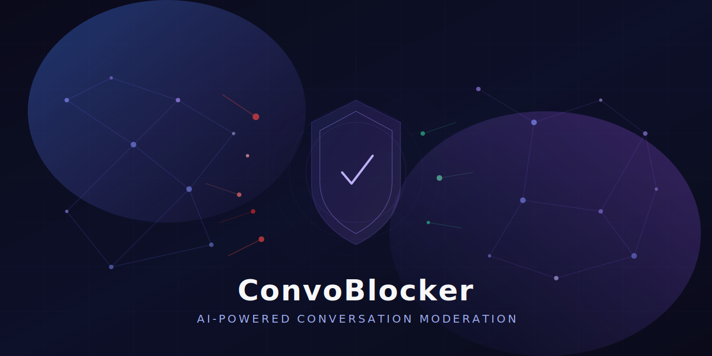

<p align="center">
  
</p>

<p align="center">
  <strong>AI-powered Chrome extension that detects and blocks toxic conversations in real-time</strong>
</p>

<p align="center">
  <a href="#features">Features</a> &bull;
  <a href="#implementations">Implementations</a> &bull;
  <a href="#getting-started">Getting Started</a> &bull;
  <a href="#tech-stack">Tech Stack</a>
</p>

---

## Features

- **Real-time moderation** &mdash; Analyzes messages as they appear using AI agents
- **Multi-provider AI** &mdash; Works with Gemini, OpenAI, Groq, or local Ollama models
- **Smart detection** &mdash; Catches spam, trolling, hate speech, and more via pattern detection + LLM reasoning
- **Native blocking** &mdash; Performs actual platform blocks, not just hiding content
- **Decision caching** &mdash; Avoids re-analyzing known users with a 5-minute TTL cache
- **Configurable categories** &mdash; Toggle which types of content to moderate
- **Custom prompts** &mdash; Tailor the AI's moderation style to your needs

## Implementations

This repo includes two distinct approaches to AI-powered content moderation:

### YouTube Live Chat Blocker (`claude_version/`)

A specialized moderation system for YouTube live streams that batch-processes chat messages and blocks problematic users in real-time.

**How it works:**
```
Live Chat Messages (batched) --> FastAPI Backend --> LangChain Agent
  --> Pattern Detection (heuristics, free)
  --> Message Classification (DSPy + LLM)
  --> User History Lookup (SQLite)
  --> Final Decision (block / allow / watch)
  --> Native YouTube Block or Hide
```

**Key highlights:**
- Batch processing (up to 15 messages at 3-second intervals)
- Tool-based agent architecture with LangChain
- SQLite database for stats, block logs, and user history
- Three-tier decisions: block, allow, or watch
- Unblock users from the extension popup

### Social Feed Filter (`codex_version/`)

A general-purpose content filter that works across multiple social platforms (Twitter/X, Reddit, YouTube feeds).

**How it works:**
```
Feed Content --> Content Script --> Background (API call) --> FastAPI Backend
  --> DSPy Predictor --> LLM --> {hide: bool, reason: str, confidence: float}
```

**Key highlights:**
- Multi-platform support with site allowlists
- Keyword-based filtering with AI fallback
- Configurable hide modes (collapse or remove)
- Runtime selection between DSPy and DeepAgents

## Getting Started

### Prerequisites

- Python 3.12+
- Chrome browser
- An API key for at least one AI provider (Gemini, OpenAI, Groq) **or** a local [Ollama](https://ollama.ai) instance

### YouTube Live Chat Blocker (claude_version)

```bash
# 1. Set up the backend
cd claude_version/backend
python -m venv .venv
source .venv/bin/activate      # Windows: .venv\Scripts\activate
pip install -r requirements.txt

# 2. Start the server
uvicorn server:app --host 0.0.0.0 --port 8000 --reload
```

```
# 3. Load the extension
- Open chrome://extensions
- Enable "Developer mode"
- Click "Load unpacked" -> select claude_version/extension/
- Click the extension icon to configure AI provider & categories
```

### Social Feed Filter (codex_version)

```bash
# 1. Set up the backend
cd codex_version/agent_service
python -m venv .venv
source .venv/bin/activate      # Windows: .venv\Scripts\activate
pip install -r requirements.txt

# 2. Configure environment
cp .env.example .env
# Edit .env and add your API keys

# 3. Start the server
uvicorn app:app --host 127.0.0.1 --port 8000 --reload
```

```
# 4. Load the extension
- Open chrome://extensions
- Enable "Developer mode"
- Click "Load unpacked" -> select codex_version/extension/
- Right-click extension -> Options to configure provider, model, and preferences
```

## Tech Stack

| Layer | Technology |
|-------|-----------|
| Extension | Chrome Manifest V3, JavaScript |
| Backend | Python, FastAPI, Uvicorn |
| AI Frameworks | LangChain, DSPy, DeepAgents |
| Models | Gemini 2.0 Flash, GPT-4.1-mini, Llama 3.3, Ollama (local) |
| Database | aiosqlite (async SQLite) |

## Project Structure

```
convoBlocker/
├── claude_version/          # YouTube Live Chat Blocker
│   ├── backend/
│   │   ├── server.py        # FastAPI server
│   │   ├── agent.py         # LangChain moderation agent
│   │   ├── db.py            # SQLite database layer
│   │   ├── dspy_modules.py  # DSPy classifiers
│   │   └── tools/           # Agent tools (classifier, pattern detector, etc.)
│   └── extension/
│       ├── manifest.json
│       ├── content.js       # YouTube live chat injection
│       ├── background.js    # Service worker
│       └── popup.*          # Extension popup UI
├── codex_version/           # Social Feed Filter
│   ├── agent_service/
│   │   └── app.py           # FastAPI filter service
│   └── extension/
│       ├── manifest.json
│       ├── content.js       # Multi-platform content script
│       ├── background.js    # Service worker
│       ├── popup.*          # Extension popup
│       └── options.*        # Settings page
└── assets/
    └── hero.svg             # Project banner
```

## License

This project is provided as-is for educational and personal use.
